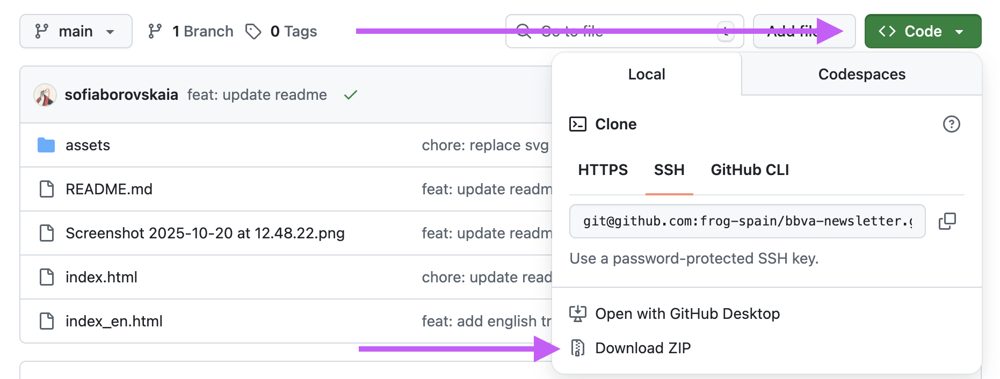

# BBVA Spark Newsletter

Una plantilla de boletín de noticias por correo electrónico responsive para BBVA Spark, que incluye listados de eventos, actualizaciones de financiación y noticias de innovación.

## Demo

Haz clic [aquí](https://frog-spain.github.io/bbva-newsletter/) para ver la demo de la newsletter en español.

Para descargar el proyecto, haz clic en 'Code' y selecciona 'Download ZIP':

## Características

- **Soporte bilingüe**: Disponible en español (`index.html`) e inglés (`index_en.html`)
- **Diseño responsive**: Optimizado para clientes de correo electrónico de escritorio y móvil
- **Compatibilidad con clientes de correo**: Diseñado para Outlook, Gmail, Apple Mail y clientes móviles

## Detalles técnicos

- **Maquetación basada en tablas** para máxima compatibilidad con clientes de correo
- **Enfoque híbrido de CSS**:
  - Estilos en línea para el estilo principal y compatibilidad con clientes de correo
  - Clases CSS con media queries para comportamiento responsive
- **Imágenes**: Se utilizan archivos PNG en lugar de SVG debido a las limitaciones de compatibilidad de los clientes de correo electrónico. Aunque los SVG ofrecen mejor calidad y escalabilidad, muchos clientes de correo (especialmente versiones de Outlook) no los soportan adecuadamente, lo que podría resultar en imágenes rotas o no visualizadas. Los PNG garantizan la visualización correcta en todos los clientes de correo.
